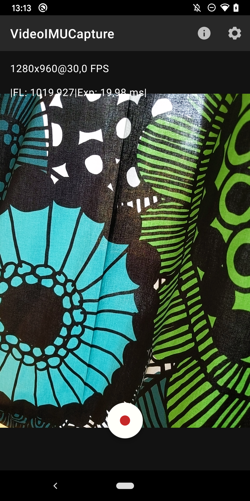
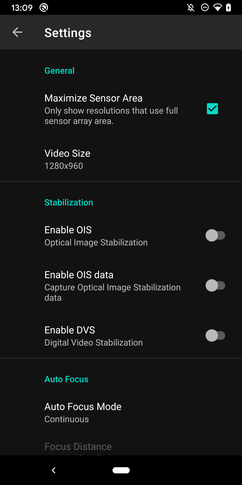
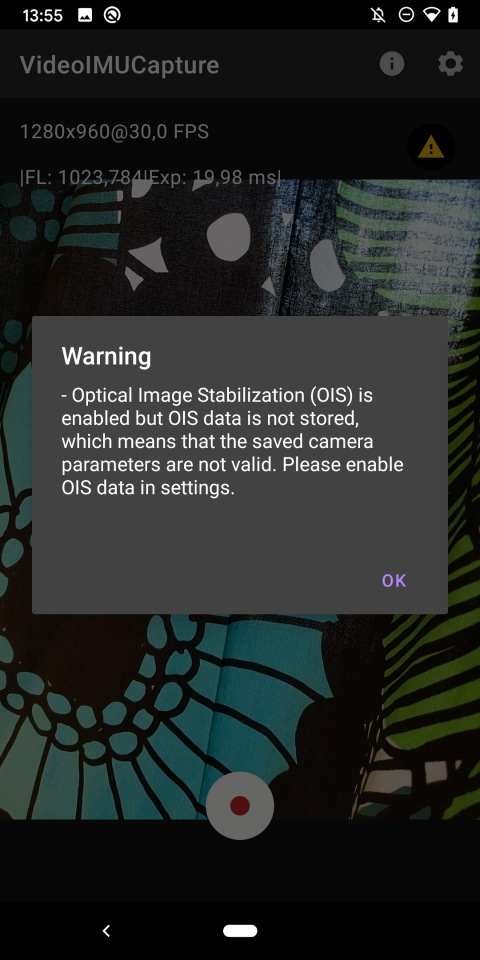

# VideoIMUCapture-Android
Android application for capturing video and IMU data useful for 3D reconstruction using SLAM and Structure from Motion techniques.

# Description
This Android application is a data collection tool for researchers working with Simultaneous Localization and Mapping (SLAM) and Structure from Motion (SfM).

It records Camera Frames at ~30Hz and Inertia Measurement Unit (IMU) data at ~100Hz synchronized to the same clock, given that the [Android device supports it](https://developer.android.com/reference/android/hardware/camera2/CameraCharacteristics#SENSOR_INFO_TIMESTAMP_SOURCE).
The camera frames are stored to a H.264/MP4 video file and the frame meta data together with IMU data is stored in a protobuf3 file.

A major problem with modern smartphones and 3D reconstruction is that all have Optical Image Stabilization (OIS), which means different camera parameters for each frame.
Furthermore, on many Android devices it cannot be disabled and a rare few actually supply the data of the lens movement.
VideoIMUCapture shows a clear warning if you have this feature on during recording and includes settings for both Optical Image Stabilization and Digital Video Stabilization (DVS).

This code is forked from [mobile-sensor-ar-logger](https://github.com/OSUPCVLab/mobile-ar-sensor-logger) which in turn is based on the [grafika](https://github.com/google/grafika/blob/master/app/src/main/java/com/android/grafika/CameraCaptureActivity.java) project.
For the video capture it uses the Camera2 API.

# Features
- Captures camera frames at ~30Hz to H.264/MP4.
- Captures IMU data at ~100Hz.
- Synchronized clock, assuming [the device supports it](https://developer.android.com/reference/android/hardware/camera2/CameraCharacteristics#SENSOR_INFO_TIMESTAMP_SOURCE).
- Stores IMU data and all frame meta data in a protobuf file, check [recording.proto](https://github.com/DavidGillsjo/VideoIMUCapture-Android/blob/master/protobuf/recording.proto) to see what data is included.
- Display warning if OIS or DVS is enabled since this affects the camera parameters.
- Settings menu for configuring video resolution, OIS, DVS, Auto focus and Auto exposure.

# Install
To install on your Android device go to the [Release page](https://github.com/DavidGillsjo/VideoIMUCapture-Android/releases) from your Android device browser and download the latest `.apk` file. You will need to give your browser permission to install the application, but Android should guide you through the necessary steps.

# Feedback
If you find any bugs or have feature requests, please create an [issue](https://github.com/DavidGillsjo/VideoIMUCapture-Android/issues) on this Github page.
